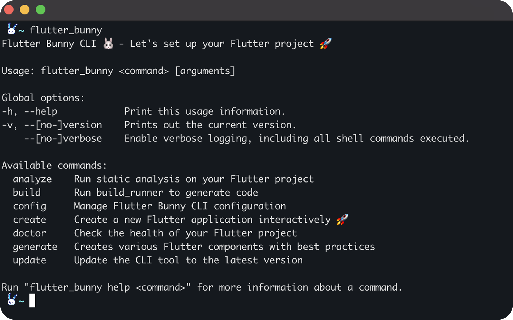

# 🐰 Flutter Bunny CLI (Beta)

A powerful CLI tool for creating and managing Flutter applications with best practices and consistent architecture.

[](https://pub.dev/packages/flutter_bunny)
[](https://opensource.org/licenses/MIT)
[](https://www.flutterbunny.xyz/)



---

## 📚 Overview

Flutter Bunny is an opinionated CLI tool that helps you create, manage, and maintain Flutter applications with a focus on:

- **Best practices** — Follow Flutter community best practices
- **Consistent architecture** — Choose Clean Architecture, MVVM, or MVC
- **Rapid development** — Generate components quickly
- **Testing support** — Templates for unit, widget, and integration tests
- **Project maintenance** — Keep your project organized and up-to-date

---

## 🚀 Installation

### Using Dart

```bash
dart pub global activate flutter_bunny 1.0.7-beta.9

# Verify installation
flutter_bunny --version
```

Make sure the pub cache bin directory is in your PATH.

---

### Using Homebrew (macOS)

```bash
brew tap demola234/homebrew-tap
brew install flutter_bunny
```

---

## 🏗️ Available Commands

| Command | Description |
|:---|:---|
| `create` | Create a new Flutter app interactively |
| `generate` | Generate screens, widgets, models, and more |
| `analyze` | Run static analysis |
| `build` | Run `build_runner` |
| `update` | Update Flutter Bunny CLI |
| `config` | Manage configuration settings |
| `doctor` | Check Flutter project health |

Run `flutter_bunny help <command>` for detailed usage.

---

## 🛠️ Creating a New Flutter Project

```bash
flutter_bunny create app
```

You'll be guided through selecting:

- Project name and organization
- Architecture pattern (Clean Architecture, MVVM, MVC)
- State management (Provider, Riverpod, Bloc, etc.)
- Features and modules to include

_Example with specific options:_

```bash
flutter_bunny create app --name my_awesome_app --architecture clean_architecture --state-management riverpod
```

---

## ✨ Generating Models

You can now generate models interactively, from JSON samples, or with specific serialization methods.

### Commands

```bash
# Start an interactive session
flutter_bunny generate model --name User

# Generate a model with specific serializer
flutter_bunny generate model --name Product --serializer json_serializable

# Generate a model from a JSON string
flutter_bunny generate model --name User --json '{"id": 1, "name": "John", "email": "john@example.com"}'

# Generate in non-interactive mode
flutter_bunny generate model --name Order --interactive false
```

---

### Options

| Option | Description |
|:---|:---|
| `--name` or `-n` | **(Required in non-interactive mode)** Model name |
| `--directory` or `-d` | Directory to create model (default: `lib/models`) |
| `--serializer` or `-s` | Serialization method: `freezed`, `json_serializable` (default), `manual`, or `equatable` |
| `--interactive` or `-i` | Use interactive mode (default: true) |
| `--json` | Provide a JSON sample or path to generate the model |

---

### Interactive Mode

When enabled (`--interactive true`):

- Prompt for model name
- Choose serialization method
- Enter JSON manually or load from file
- Detect nested models and generate them
- Suggest dependencies like `freezed_annotation`, `json_serializable`

---

### Examples

#### Generate Model with Interactive Configuration

```bash
flutter_bunny generate model
```

#### Generate Product Model Using Freezed

```bash
flutter_bunny generate model --name Product --serializer freezed
```

#### Generate Model from JSON File

```bash
flutter_bunny generate model --name ApiResponse --json path/to/sample.json
```

#### Generate Multiple Models from Complex JSON

```bash
flutter_bunny generate model --name Order --json '{"id": 123, "items": [{"productId": 1, "quantity": 2}], "customer": {"id": 456, "name": "John Doe"}}'
```

---

### Generated Output

- Model files created in `lib/models`
- Correct serialization setup
- Imports and part files generated if needed
- Dependency suggestions provided
- Build runner commands shared

---

## 📋 Project Structure Examples

### Clean Architecture

```
lib/
├── core/
│   ├── errors/
│   ├── network/
│   ├── utils/
│   └── theme/
├── data/
│   ├── datasources/
│   ├── models/
│   └── repositories/
├── domain/
│   ├── entities/
│   ├── repositories/
│   └── usecases/
├── presentation/
│   ├── blocs/
│   ├── pages/
│   └── widgets/
└── main.dart
```

### MVVM

```
lib/
├── models/
├── services/
├── view_models/
├── views/
│   ├── screens/
│   └── widgets/
└── main.dart
```

### MVC

```
lib/
├── models/
├── services/
├── views/
│   ├── controllers/
│   ├── models/
│   └── views/
└── main.dart
```

---

## 🧩 Supported State Management Options

- **Provider**
- **Riverpod**
- **Bloc/Cubit**
- **GetX**
- **MobX**
- **Redux**

---

## 🧪 Testing Utilities

Projects are scaffolded with testing support:

```bash
# Run all tests
flutter_bunny test

# Run unit tests only
flutter_bunny test --type unit
```

Includes:

- Unit Tests
- Widget Tests
- Integration Tests

---

## 🔧 Maintenance Commands

```bash
# Analyze the project
flutter_bunny analyze

# Check project health
flutter_bunny doctor

# Update CLI
flutter_bunny update
```

---

## 🎨 Configuration and Custom Templates

```bash
# Show current config
flutter_bunny config show

# Set defaults (e.g., architecture)
flutter_bunny config set default_architecture clean_architecture
```

You can also create custom templates under `~/.flutter_bunny/templates/`.

---

## 🤝 Contributing

Contributions are welcome! Please:

1. Fork the repo
2. Create a feature branch
3. Submit a Pull Request

Check the [CONTRIBUTING.md](CONTRIBUTING.md) for details.

---

## 📄 License

Licensed under the [MIT License](LICENSE).

---

## 📞 Support

- Open an [Issue](https://github.com/demola234/flutter_bunny/issues)
- View the [Official Documentation](https://www.flutterbunny.xyz/)
